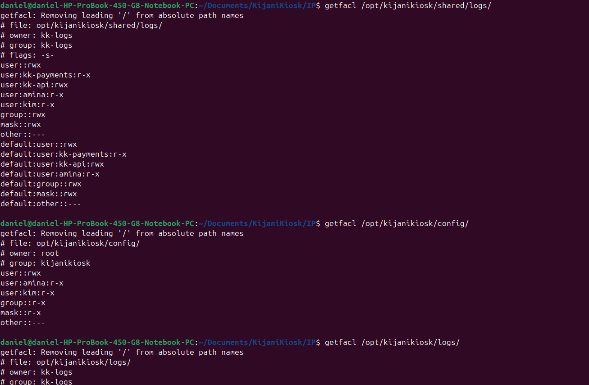

daniel@daniel-HP-ProBook-450-G8-Notebook-PC:~/Documents/KijaniKiosk/IP$ getfacl /opt/kijanikiosk/shared/logs/
getfacl: Removing leading '/' from absolute path names
# file: opt/kijanikiosk/shared/logs/
# owner: kk-logs
# group: kk-logs
# flags: -s-
user::rwx
user:kk-payments:r-x
user:kk-api:rwx
user:amina:r-x
user:kim:r-x
group::rwx
mask::rwx
other::---
default:user::rwx
default:user:kk-payments:r-x
default:user:kk-api:rwx
default:user:amina:r-x
default:group::rwx
default:mask::rwx
default:other::---

daniel@daniel-HP-ProBook-450-G8-Notebook-PC:~/Documents/KijaniKiosk/IP$ getfacl /opt/kijanikiosk/config/
getfacl: Removing leading '/' from absolute path names
# file: opt/kijanikiosk/config/
# owner: root
# group: kijanikiosk
user::rwx
user:amina:r-x
user:kim:r-x
group::r-x
mask::r-x
other::---

daniel@daniel-HP-ProBook-450-G8-Notebook-PC:~/Documents/KijaniKiosk/IP$ getfacl /opt/kijanikiosk/logs/
getfacl: Removing leading '/' from absolute path names
# file: opt/kijanikiosk/logs/
# owner: kk-logs
# group: kk-logs
user::rwx
group::r-x
other::---

daniel@daniel-HP-ProBook-450-G8-Notebook-PC:~/Documents/KijaniKiosk/IP$ getfacl /opt/kijanikiosk/api/
getfacl: Removing leading '/' from absolute path names
# file: opt/kijanikiosk/api/
# owner: kk-api
# group: kk-api
user::rwx
user:kim:r-x
group::r-x
mask::r-x
other::---

daniel@daniel-HP-ProBook-450-G8-Notebook-PC:~/Documents/KijaniKiosk/IP$ getfacl /opt/kijanikiosk/payments/
getfacl: Removing leading '/' from absolute path names
# file: opt/kijanikiosk/payments/
# owner: kk-payments
# group: kk-payments
user::rwx
group::r-x
other::---

